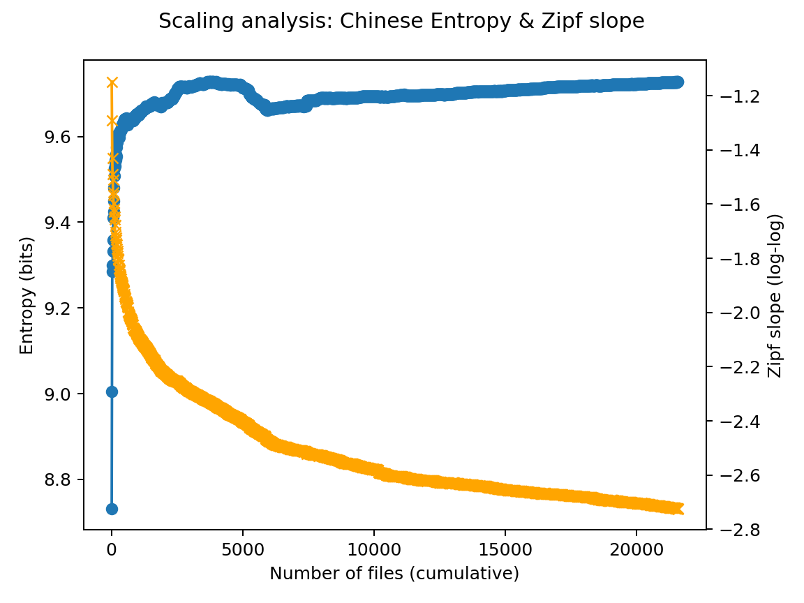

# 技术报告：基于人民日报语料的汉字信息熵与齐夫定律分析
## 1.介绍

本项目旨在通过编写 Python 爬虫程序，从人民日报网站爬取真实的新闻文本数据，构建大规模中文语料库。在此基础上，通过编写文本分析程序，计算语料中的汉字概率分布与信息熵，并验证中文文本是否符合齐夫定律 (Zipf’s Law).实验同时分析语料规模与统计规律的关系，研究自然语言信息分布的统计特性.

## 2.实验环境与工具
| 类别 | 工具/版本 |
|------|------------|
| 操作系统 | Windows  11 |
| Python 版本 | 3.11 |
| 主要依赖库 | `requests`, `beautifulsoup4`, `tqdm`, `re`, `math`, `csv`, `matplotlib` |
| 运行环境 | VSCode  |
| 数据来源 | 人民日报电子版：http://paper.people.com.cn/rmrb/ |

## 3.系统组成
本实验分为两大模块：

| 模块   | 文件名                       | 功能说明                                                                                                                                                                                                                                    |
| ---- | ------------------------- | --------------------------------------------------------------------------------------------------------------------------------------------------------------------------------------------------------------------------------------- |
| 爬虫模块 | `data_c.py` | 爬取人民日报新闻文本，支持日期输入与进度条显示。脚本来自 [GitHub](https://github.com/caspiankexin/people-daily-crawler-date/blob/master/%E4%BA%BA%E6%B0%91%E7%BD%91%E4%BA%BA%E6%B0%91%E6%97%A5%E6%8A%A5%E7%88%AC%E8%99%AB%EF%BC%88%E7%AC%AC3%E7%89%88%EF%BC%89.py)。 |
| 分析模块 | `main.py`                 | 统计汉字频率、计算信息熵、验证齐夫定律并生成可视化结果。                                                                                                                                                                                                            |


---

## 4.数据采集模块程序设计
### 4.1模块功能
该模块可以自动爬取给定时期人民日报新闻数据，获取每日所有版面与文章，仅保留 \u4e00-\u9fff 范围的汉字。同时将符号供后续文本分析。本项目爬取了2025-01-01至2025-08-31，共243天的人民日报文本数据。共计21,576个文本文件，22,253,468个汉字。
### 4.2核心代码结构
#### （1）网页获取
```python
def fetchUrl(url):
    headers = {
        'user-agent': 'Mozilla/5.0 (...) Chrome/68.0',
    }
    r = requests.get(url, headers=headers)
    r.raise_for_status()
    r.encoding = r.apparent_encoding
    return r.text
```
#### （2）网页解析
```
def getPageList(year, month, day):
    url = f'http://paper.people.com.cn/rmrb/pc/layout/{year}{month}/{day}/node_01.html'
    html = fetchUrl(url)
    soup = bs4.BeautifulSoup(html, 'html.parser')
```
#### （3）内容保存
```
def getContent(html):
    soup = bs4.BeautifulSoup(html, 'html.parser')
    title = soup.h1.text if soup.h1 else '(无标题)'
    paragraphs = soup.find('div', id='ozoom').find_all('p')
    content = '\n'.join(p.text for p in paragraphs)
    return f"{title}\n{content}"
```

### 4.3 目录结构
```
homework/
 ├─ 20250101/
 │   ├─ 20250101-01-01.txt
 │   ├─ 20250101-01-02.txt
 │   └─ ...
 ├─ 20250102/
 │   ├─ 20250102-01-01.txt
 │   └─ ...
 └─ ...
 ```
### 4.4 爬取结果统计
| 日期范围                    | 爬取天数 | 文件数 | 总字数       | 平均每日文件数 |
| ----------------------- | ---- | --- | --------- | ------- |
| 2025-01-01 至 2025-08-31 | 242   | 21576 | 22253468 | 89.157025  |


## 5.数据分析模块程序设计
### 5.1 模块功能
该模块用于对爬取的语料进行中文文本分析，清晰文本后统计汉字出现的频率与概率，从而验证齐夫定律(Zipf’s Law)。随后计算中文信息熵。最后进行样本扩容分析，观察熵与齐夫定律的稳定性。

### 5.2 主要函数介绍
#### （1）文件读取与清洗
```
def read_text(path):
    with open(path, "r", encoding="utf-8", errors="ignore") as f:
        txt = f.read()
    txt = txt.replace("\r\n", "\n").replace("\r", "\n")
    txt = re.sub(r"[ \t\u00A0]+", " ", txt)
    txt = txt.replace("\u3000", " ")
    txt = "".join(ch for ch in txt if (ch == "\n" or (ord(ch) >= 32 and ch != "\x7f")))
    txt = txt.replace("\ufffd", "")
    return txt
```
#### (2) 信息熵计算
$$
H = -\sum_{i}^{}p_ilog_2p_i
$$

```
def probs_and_entropy(counter):
    total = sum(counter.values())
    prob = {k: v / total for k, v in counter.items()}
    entropy = -sum(p * math.log(p, 2) for p in prob.values())
    return total, prob, entropy
```
#### (3) 齐夫定律验证
$$
log(f)=a+b*log(r)
$$

```
def linear_fit_loglog(rank_freq_list):
    xs, ys = [], []
    for r, _, f in rank_freq_list:
        xs.append(math.log(r))
        ys.append(math.log(f))
    return a, b, r2
```
### 5.3 输出结果
程序自动保存以下文件

| 文件名                         | 内容              |
| --------------------------- | --------------- |
| `cn_char_probabilities.csv` | 汉字、频率、概率        |
| `zipf_cn_rank_freq.csv`     | 齐夫定律排名与频率       |
| `zipf_cn_loglog.png`        | Zipf 双对数图       |
| `scaling_results.csv`       | 扩容结果（熵与斜率随样本变化） |
| `scaling_entropy_slope.png` | 熵与齐夫斜率的变化趋势图   |

### 5.4 程序输出
```
[INFO] 发现 21,576 个文件，开始读取与清洗 …
[中文统计] 汉字总数: 22,253,468；唯一汉字: 6,210；信息熵: 9.7273 bits
[Zipf定律] log(freq) = 25.8416 + (-2.7228) * log(rank)，R² = 0.8224
```
## 6.结果
### 6.1 汉字信息熵
信息熵计算公式

$$
H = -\sum_{i}^{}p_ilog_2p_i
$$

| 指标    | 数值            |
| ----- | ------------- |
| 总汉字数  | 22253468     |
| 唯一汉字数 | 6210         |
| 信息熵 H | **9.73 bits** |

信息熵本质上是衡量信息系统中不确定性和复杂度的指标，它反映了语言符号分布的多样性与均衡性。一般而言，汉字的信息熵标准值大约介于7.0至9.0比特之间：日常口语化文本或网络语言通常在7比特左右，普通新闻报道、说明文大多在8至9比特区间，而能达到或超过9.0的文本往往具有极高的信息密度与语义复杂度。
根据项目结果，《人民日报》中文信息熵高达9.73，这一结果符合预期。《人民日报》作为我国新闻报道的标杆报刊。报道的范围涵盖治、经济、科技、文化、社会等多个领域。并且其用词具有相当高的准确性。高熵文本意味着在自动文本分析、自然语言处理等任务中，这类文本的建模难度极大，因为机器必须捕捉更多上下文信息才能理解其中的语义关系。从社会语言学角度看，这样的高信息熵正反映了国家级官方媒体在语言表达上的成熟与规范，它代表了现代汉语书面语的高复杂度形态，也体现了新闻语言在传达深度信息与多维意义时的高效率与精准度。

### 6.2 齐夫定律验证
拟合方程：

$$
log(freq) = 25.8419 + (-2.7228) * log(rank)
$$

R² = 0.8224,说明拟合效果良好。
Zipf 双对数图如下

### 6.3 扩容分析结果
扩容趋势表

| 样本文件数 | 唯一汉字数 | 总汉字数  | 信息熵 (bits) | Zipf 斜率 | R^2 |
| ----- | ----- | ----- | ---------- | ------- | ----- |
| 10    | 1005  | 9392  | 8.73       | -1.148  | 0.910 |
| 20    | 1371  | 21878 | 9.01       | -1.290  | 0.880 |
| 30    | 2036  | 43744 | 9.30       | -1.429  | 0.890 |
| 40    | 2100  | 62834 | 9.29       | -1.488  | 0.882 |
| 50    | 2183  | 69763 | 9.33       | -1.510  | 0.879 |
| 60    | 2327  | 82609 | 9.33       | -1.512  | 0.878 |
| ...   | ...   | ...   | ...        | ...     | ...   |
| 21576   | 6210   | 22253468   | 9.73        | -2.72    | 0.822   |


其中蓝色线为信息熵，黄色线为齐夫定律所对应的双对数斜率

## 7.参考文献
| 序号   | 参考文献                                                                  |
| ---- | --------------------------------------------------------------------- |
| \[1] | Zipf, G. K. *Human Behavior and the Principle of Least Effort.* 1949. |
| \[2] | Shannon, C. E. *A Mathematical Theory of Communication.* 1948.        |
| \[3] | 国家语言资源监测与研究中心，《现代汉语语料库统计报告》。                                          |
| \[4] | Wikipedia: [Zipf's law](https://en.wikipedia.org/wiki/Zipf%27s_law)   |


